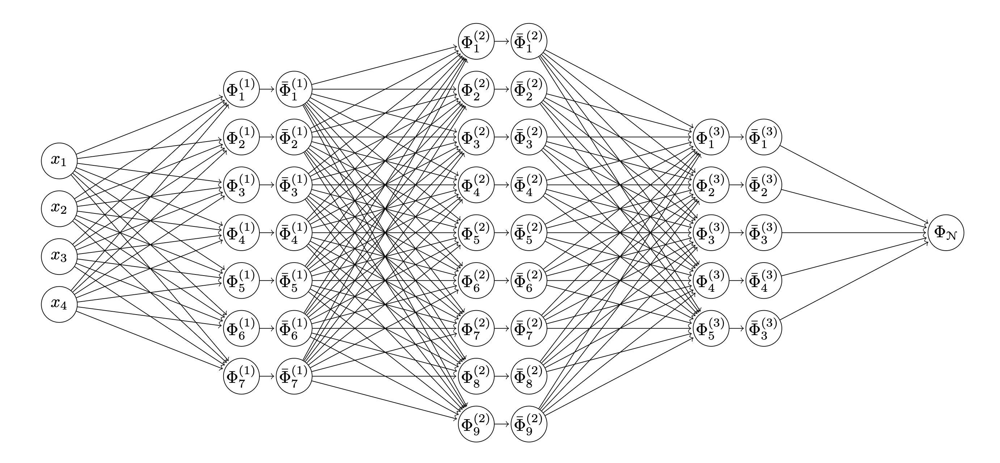

# Building-a-Neural-Network-from-Scratch

  

This project implements a feedforward neural network for binary classification from scratch in MATLAB.

Core deep learning components are built manually:

	•	Forward propagation
	•	Backpropagation
	•	Gradient Descent (GD)
	•	Stochastic Gradient Descent (SGD)

The focus is on understanding the mathematical foundations of neural network training without using external ML libraries.

---

Model

	•	Architecture: Layer sizes 2 → 3 → 3 → 1
	•	Activation: Sigmoid
	•	Task: Binary classification on [0,1]^2
	

Tech Stack

	•	MATLAB
	•	No external dependencies

---

The implementations are based on the mathematical formulation for feed forward neural networks found in C. Higham and D. Higham, Deep Learning: An Introduction for Applied Mathematicians. SIAM REVIEW, Vol. 61, No. 4, pp. 860-891, 2019.
